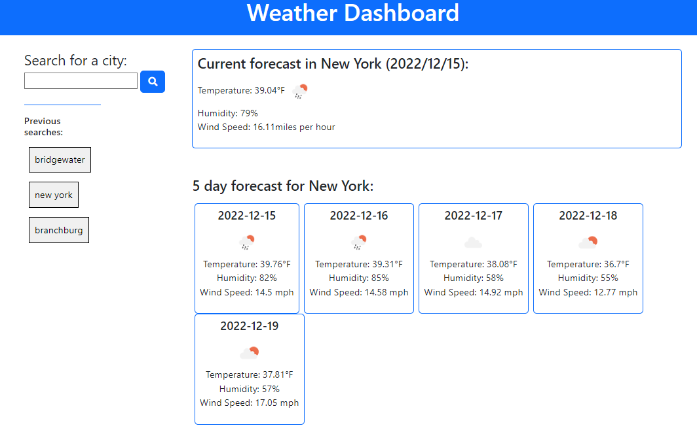

# Weather Dashboard

Search any city to get the current weather and a five-day forecast!

## Description

This project's objective was to build a responsive website using HTML, CSS, and JavaScript to pull data from OpernWeather's API. This project contains a search input field for a user to search any city, which returns a card displaying the current weather of that searched city. Underneath is a five-day forecast, with five cards, labeled with the corresponding date of that five-day forecast. On the left-hand side, there is a previously searched section with a button representing that previous search. Upon clicking, it will display the forecast again for that city, as if it were searched again.

## Installation

Using git bash (Windows) or terminal (MacOS):

1. Download ZIP found under `<> Code` and run the repo to open into VS Code  
OR clone the repo using `git clone git@github.com:pljon/weather-dashboard.git`
2. Path to repo's location on local machine using `cd`
3. Open repo on VS code using `code .` to begin working on it locally

## Remote Link

This link reflects the current source code found in this repo:

https://pljon.github.io/weather-dashboard/

## Screenshot

